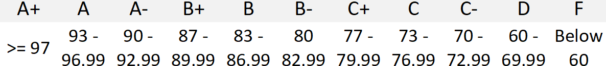

# UCSD CSE 8B Winter 2023
## Intro to Programming 2

_Greg Miranda_

In this course, you will learn to write, trace, and test programs; explore the
interactions between programs and data; and practice organizing programs for
clarity and re-use.

We will explore these topics interactively in lecure, you will implement
programs to practice your programming skills, and you will reflect on this
learning through your own program designs.

This web page serves as the main source of announcements and resources for the
course, as well as the syllabus.

On an average week in CSE8B, you can expect to spend 4-6 hours on videos,
reading, lecture, and discussion; 2-3 hours on programming practice; and 4-6
hours working on your programming projects. If you find yourself spending
dramatically more time than this, it's a good idea to contact the course staff
and discuss more efficient strategies in office hours.

## Course Components

There are a few components to your grade in the course:

- 10% Lecture Participation
- 15% Completing book exercises in Stepik and course engagement activities (surveys)
- 40% Programming assignments
- 35% Exams
  - 15% Midterm Exam
  - 20% Final Exam

We may adjust the above scale to be more lenient 
(depending on a number of factors that we will not publicize), but we guarantee 
that we will not adjust the scale to make it harder to get a better grade. 
We will not adjust the scale for individual students. 

<h3>Lecture - Problem Sessions</h3>

Most course content will be presented asynchronously through pre-lecture videos and
Stepik readings, with associated interactive activities. Lectures will involve problem
solving with your classmates. 

**In-person sessions** will be led during the normally-scheduled lecture times
in the normally-scheduled room, led by the instructor. These sessions will be
recorded by podcasting but will not be available remotely while they are ongoing. 
You can find the recordings in the Canvas Media Gallery or 
at [podcast.ucsd.edu](https://podcast.ucsd.edu){:target="_blank"}

Since these lectures may be mostly student discussion, the recordings are mostly 
an archive of any live demos that come up rather than a presentation of core content.

Starting with the second lecture, we will take attendance during lecture (except exams).
You must attend at least 15 lectures to earn full credit for lecture particpation.
To receive credit for attending, you must make sure to check-in during lecture 
(check-ins will happen at random times in the middle of the lecture), we will 
not accept any check-ins after lecture and credit for attendance will not be given retroactively.

Attendance check-ins will be handled through Gradescope therefore it's highly recommended to download 
the Gradescope mobile app to your phone so you can upload your worksheets. Otherwise, you will 
need to hand-in your worksheets after lecture and come to office hours to get them back.

<h3>Discussion</h3>

Teaching Assistants (TAs) will hold a weekly discussion section to cover the weekly 
programming assignment, review prior content, and answer student questions.
Participation is not required at discussion, but it is highly encouraged.

Like lectures, discussions will also be recorded and made available in the Canvas Media Gallery or 
at [podcast.ucsd.edu](https://podcast.ucsd.edu){:target="_blank"}

### Book Exercises/Quizzes and Course Engagement

Along with each lecture will come some required pre-lecture work. Most often
this will be reading and activities from our [Stepik textbook](https://stepik.org/course/100177/syllabus){:target="_blank"}, 
and will also sometimes include surveys or check-in quizzes so we can get your feedback about the course
and check on your understanding.

The online texbook records your progress, and we give a schedule of expected
times to finish the readings. There is no penalty for completing these late, but
they are assigned so that you will be prepared to participate in problem solving
session and so that you know the expected pace of the course. 

All Stepik exercises must be completed by the last day of class on Friday of Week 10 by 10pm.
After this time, no late submissions will be accepted, for any reason.

To ensure you get credit for the Stepik exercises, you must fill out this 
[form](https://forms.gle/GRnWWVMALtNKHAzR8){:target="_blank"}
by Friday of Week 2. Starting in Week 3, we will strive to post Stepik grades to Canvas every week.

<h3>Programming</h3>

Most weeks there will be a programming assignment. Direct practice with
programming will make up the majority of your work in the course.

There are numerous opportunities to get feedback on your work and improve:

- **Shortly after the deadline** for each assignment, the autograded portion
will automatically grade your submitted code and for the manually graded portion,
a staff member will grade your work and give feedback on what, if anything, you need to fix.

- **After you receive your grade** you can continue to improve your assignment
based on the feedback from grading. You can resubmit your work to the Late/Resubmit 
submission which will be open for up to three weeks (less for those assignments near 
the end of the quarter). Once the Late/Resubmit submission closes, your submission
will again be graded. 

There is no penalty for resubmissions, you can still earn full credit. 
We will take the highest score between your original submission and your late/resubmission.

The **Late/Resubmit** process also applies if your submission is late. You should strive
to complete each PA before it's posted deadline as the PAs are practice for the exams.
You will also receive earlier feedback and an extra grading attempt if you submit
before the original deadline.

For those assignments near the end of the quarter, the deadline for all late/resubmissions 
will be Friday of Week 10 at 10pm. We will not accept any submissions after that time, for any reason.

Each student gets a free “slip day” for each programming assignment (PA) that allow an automatic 24-hour 
extension to submit the PA. You do not have to ask to use your slip day. Just submit your 
assignment after the deadline (but before 24 hours after the deadline) to automatically use your 
slip day. There is no penalty for using this free slip day. 

Please note that all deadlines for PAs are at 10pm (not midnight).

<h3>Exams</h3>

There will be two in-person exams in this course: a midterm and a final exam. The exam dates are shown below:

- Midterm Exam: Friday, February 17th 2023
- Final Exam: Monday, March 20th 2023

The final exam will be **cumulative** and will cover all topics discussed in the course. 

**If your final exam score (in percentage) is higher than your midterm score, then your midterm score will be replaced by your final exam score!**

## Policies

### Academic Integrity

Individual assignments will describe their academic integrity requirements. You
should pay attention to the descriptions of what collaboration is allowed and
expected on each assignment.

One challenge we face as an instructional team is verifying that students are
submitting their own work. We rely on ID-checked exams to mitigate this
particular challenge to academic integrity. 

Assignments and exams will come with
specific policies for what types of collaboration is allowed, but we have one
course-wide policy – we may reach out to students to schedule a check-in on
their understanding of work they've submitted if we're suspicious about an
academic integrity violation.  

This would involve a meeting with a TA or instructor to check that the student 
has the understanding demonstrated by their work. 

We don't expect to use this option much (certainly **you** are a student that
acts with integrity!), but we state it clearly in the syllabus in case it
becomes necessary so it isn't a surprise to anyone.

You should be familiar with [the UCSD
guidelines](http://senate.ucsd.edu/Operating-Procedures/Senate-Manual/Appendices/2){:target="_blank"}
on academic integrity as well.

### Regrades

Mistakes sometimes occur in grading. Once grades are posted for an assignment,
we will allow a short period for you to request a fix (announced along with
grade release). If you don't make a request in the given period, the grade you
were initially given is final.

### Diversity and Inclusion

We are committed to fostering a learning environment for this course that
supports a diversity of thoughts, perspectives and experiences, and respects
your identities (including race, ethnicity, heritage, gender, sex, class,
sexuality, religion, ability, age, educational background, etc.).  Our goal is
to create a diverse and inclusive learning environment where all students feel
comfortable and can thrive.

Our instructional staff will make a concerted effort to be welcoming and
inclusive to the wide diversity of students in this course.  If there is a way
we can make you feel more included please let one of the course staff know,
either in person, via email/discussion board, or even in a note under the door.
Our learning about diverse perspectives and identities is an ongoing process,
and we welcome your perspectives and input.

We also expect that you, as a student in this course, will honor and respect
your classmates, abiding by the UCSD Principles of Community
(https://ucsd.edu/about/principles.html).  Please understand that others’
backgrounds, perspectives and experiences may be different than your own, and
help us to build an environment where everyone is respected and feels
comfortable.

If you experience any sort of harassment or discrimination, please contact the
instructor as soon as possible.   If you prefer to speak with someone outside
of the course, please contact the Office of Prevention of Harassment and
Discrimination: https://ophd.ucsd.edu/.
